# LEE SEUNGWON

## Career

<table>
  <tr>
    <td>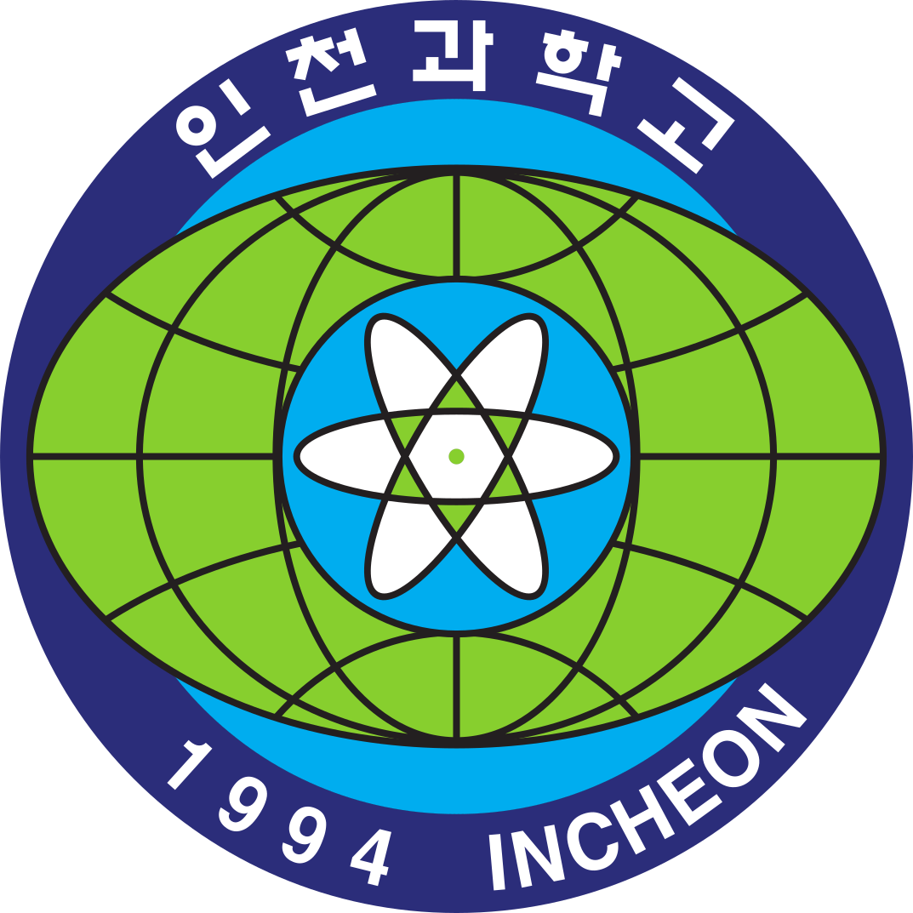</td>
    <td><b>Incheon Science High School</b></td>
    <td>2023 – 2025</td>
  </tr>
  <tr>
      <td>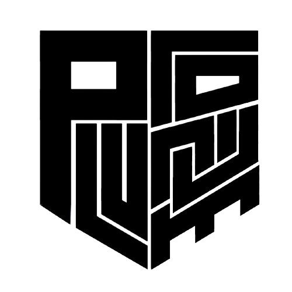</td>
    <td><b>Plutonium</b> · Mechatronics Club Leader</td>
    <td>2023 – 2025</td>
  </tr>
  <tr>
    <td></td>
    <td><b>Meca</b> · 3D Printing Club Member</td>
    <td>2023 – 2025</td>
  </tr>
  <tr>
    <td></td>
    <td><b>Konkuk University</b> · Computer Science and Engineering</td>
    <td>2026 – Present</td>
  </tr>
  <tr>
    <td>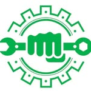</td>
    <td><b>Dolbat</b> · Mechanics Club, Autonomous Driving</td>
    <td>2026 – Present</td>
  </tr>
</table>

## Awards

-  **2023 교내 정보과학탐구대회 최우수상**
- 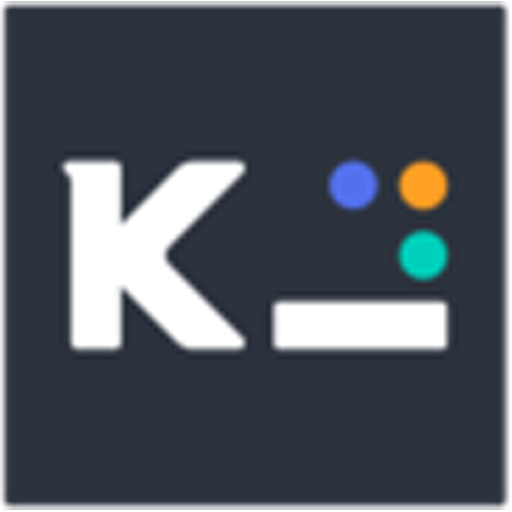 **2023 코드페어 SW공모전 고등부 결승 진출** — [NeuroAuto](https://github.com/sw8744/NeuroAuto)
-  **2023 교내 과제연구발표대회 최우수상** — [NeuroAuto](https://github.com/sw8744/NeuroAuto)
-  **2023 메타버스개발자경진대회 우수상** — [Mexpo](https://github.com/sw8744/Mexpo)
- 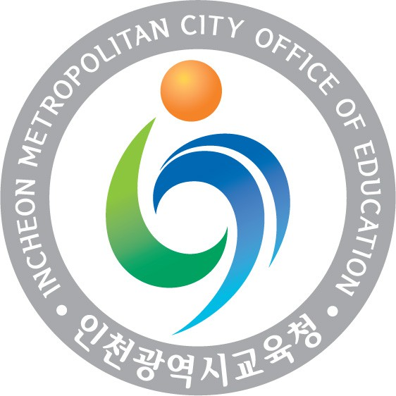 **2024 제44회 인천광역시과학전람회 우수상** — [2024-TetraLee-JRH](https://github.com/sw8744/2024-TetraLee-JRH)
-  **2024 제9회 전국 고등학교동아리소프트웨어경진대회 금상** — [Baekwoon](https://github.com/sw8744/Baekwoon)

## Skills

### Languages

<table>
  <tr>
    <td align="center" width="110">
      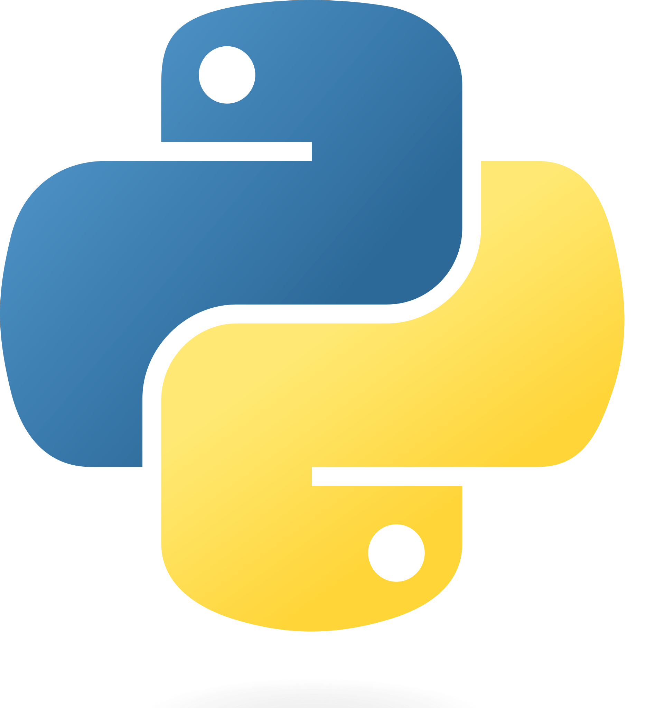 
      <b>Python</b>
    </td>
    <td align="center" width="110">
      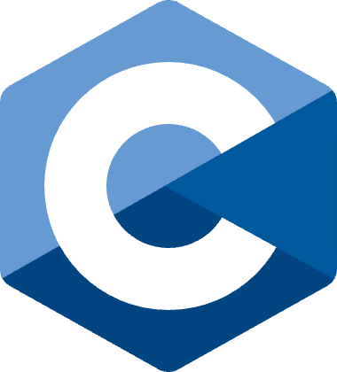 
      <b>C</b>
    </td>
    <td align="center" width="110">
      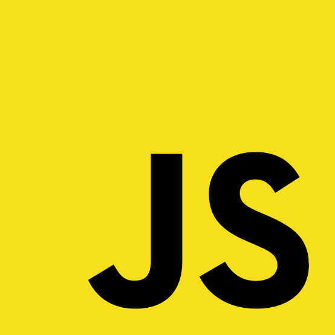 
      <b>JavaScript</b>
    </td>
    <td align="center" width="110">
      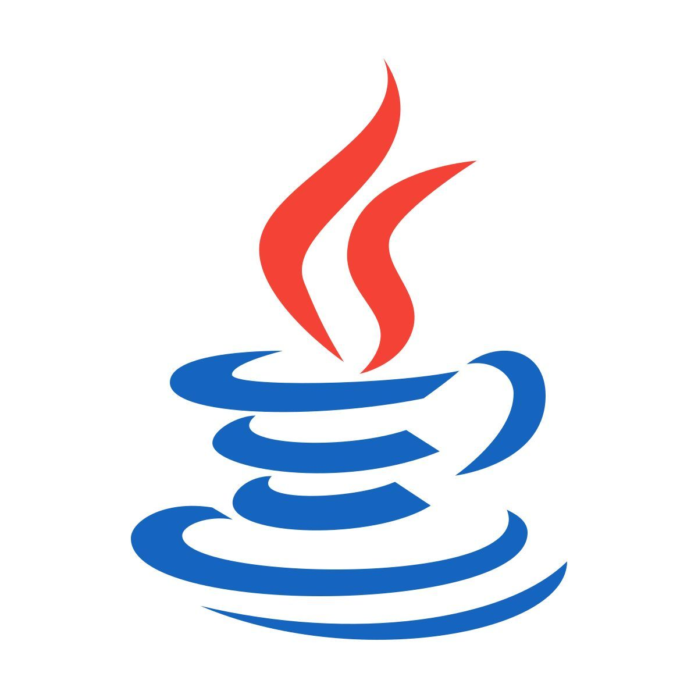 
      <b>Java</b>
    </td>
  </tr>
</table>

### Web

<table>
  <tr>
    <td align="center" width="110">
      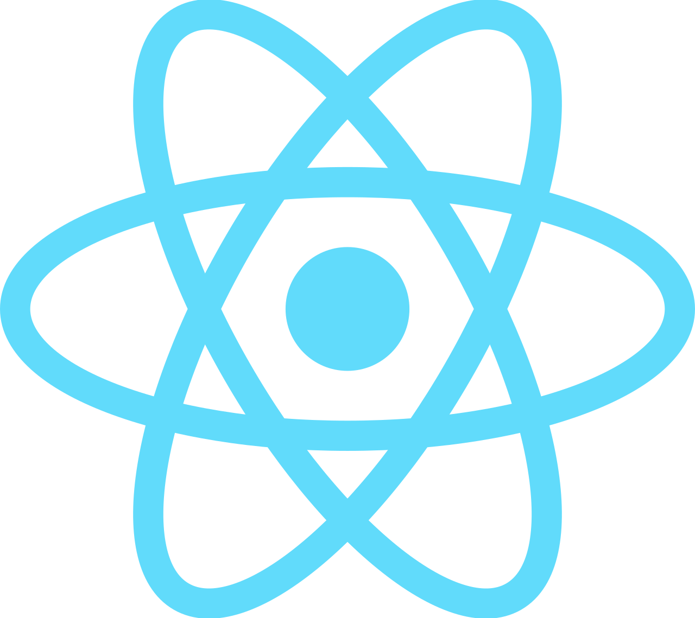 
      <b>React</b>
    </td>
    <td align="center" width="110">
      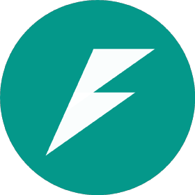 
      <b>FastAPI</b>
    </td>
    <td align="center" width="110">
       
      <b>Express.js</b>
    </td>
    <td align="center" width="110">
       
      <b>Flask</b>
    </td>
  </tr>
</table>

### AI

<table>
  <tr>
    <td align="center" width="110">
      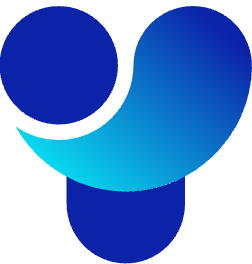 
      <b>YOLO</b>
    </td>
    <td align="center" width="110">
      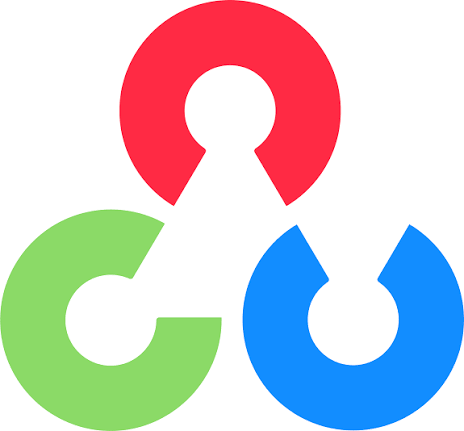 
      <b>OpenCV</b>
    </td>
    <td align="center" width="110">
      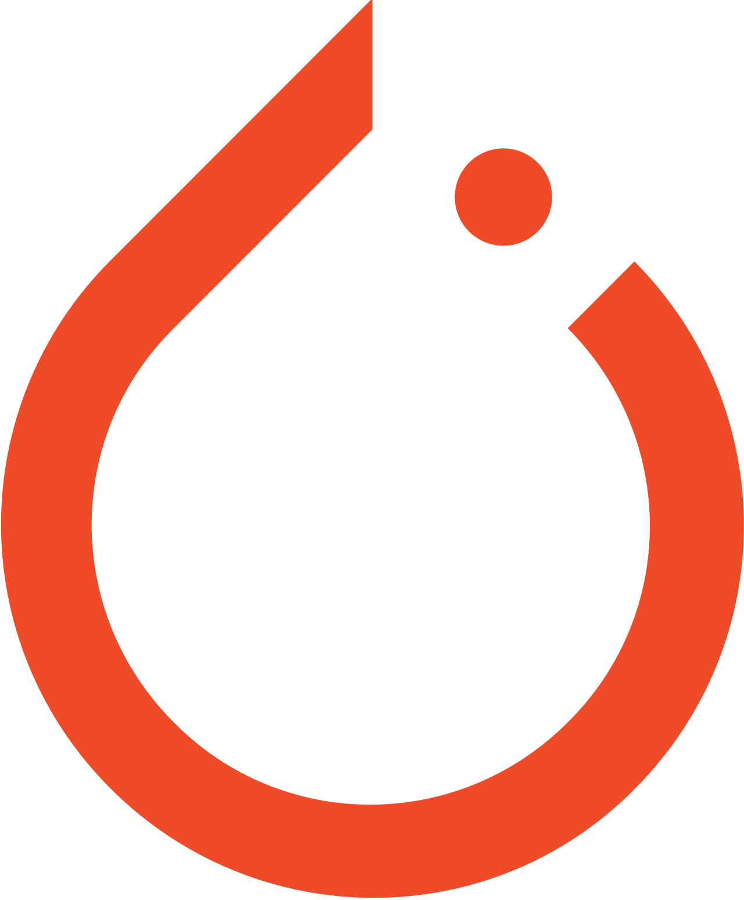 
      <b>PyTorch</b>
    </td>
    <td align="center" width="110">
      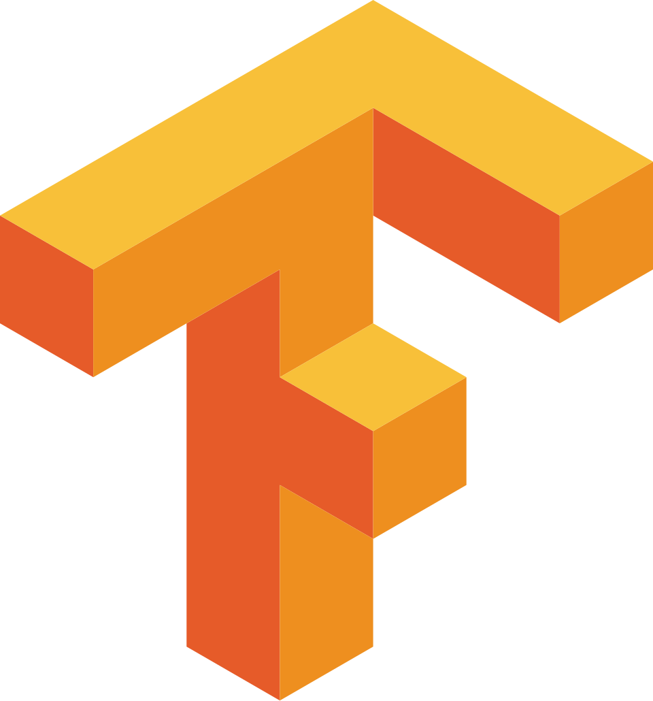 
      <b>TensorFlow</b>
    </td>
  </tr>
</table>

### Database

<table>
  <tr>
    <td align="center" width="110">
       
      <b>PostgreSQL</b>
    </td>
    <td align="center" width="110">
      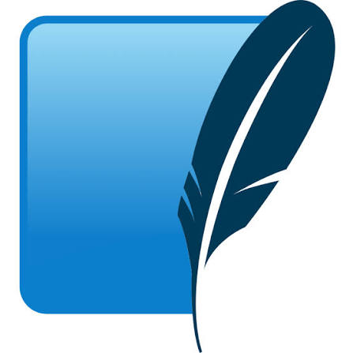 
      <b>SQLite</b>
    </td>
    <td align="center" width="110">
      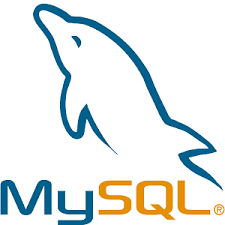 
      <b>MySQL</b>
    </td>
  </tr>
</table>

### Robotics

<table>
  <tr>
    <td align="center" width="110">
      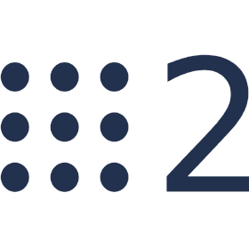 
      <b>ROS 2</b>
    </td>
  </tr>
</table>

## Projects

### 2026

####  [Dolbat-Toy-Project](https://github.com/sw8744/Dolbat-Toy-Project)

Sliding Window 기법을 통해 차선을 인식하고 주행 경로를 계획하는 프로젝트입니다.

---

### 2025

####  [Autonomous-Wheelchair](https://github.com/sw8744/Autonomous-Wheelchair)

LiDAR 센서를 사용하여 장애물을 인식하고 회피하는 자율주행 휠체어 프로젝트입니다.

####  [ishs-archive](https://github.com/sw8744/ishs-archive)

React와 FastAPI를 활용한 교내 시험지 아카이빙 서비스입니다.

####  [meal-wallpaper](https://github.com/sw8744/meal-wallpaper)

Python과 NEIS OpenAPI를 활용하여 급식 데이터를 가져오고 배경화면으로 설정하는 프로그램입니다.

---

### 2024

####  [전기자동차 제작](https://youtu.be/2tAV8zXgwCM)

12V 납축전지와 48V 모터를 사용하여 사람이 직접 탑승할 수 있는 전기자동차를 제작한 프로젝트입니다.

####  [2024-TetraLee-JRH](https://github.com/sw8744/2024-TetraLee-JRH)

디지털 소외 계층과 휠체어 사용자를 위한 높이 조절형 UI·UX 개선 키오스크 프로젝트입니다.

<table>
  <tr>
    <td></td>
    <td></td>
    <td></td>
  </tr>
</table>

####  [Ddensukki-Classification](https://github.com/sw8744/Ddensukki-Classification)

TensorFlow를 활용하여 뗀석기와 일반 돌멩이를 분류하는 프로젝트입니다.

####  [ISHS-BOB](https://github.com/sw8744/ISHS-BOB)

instagrapi와 NEIS OpenAPI를 활용하여 급식 정보를 인스타그램에 자동 업로드하는 프로젝트입니다.

####  [tello-swarm](https://github.com/sw8744/tello-swarm)

Plutonium과 Raibit 동아리가 협업하여 진행한 Tello 드론 군집 비행 프로젝트입니다.

####  [YangT-Discord](https://github.com/sw8744/YangT-Discord)

교사의 말투를 모사한 GPT 기반 Discord 챗봇 프로젝트입니다.

---

### 2023

####  [NeuroAuto](https://github.com/sw8744/NeuroAuto)

LightGBM을 활용하여 졸음 감지 AI 모델을 개발하고 적용한 프로젝트입니다.

####  [Mexpo](https://github.com/sw8744/Mexpo)

2030 부산엑스포 유치를 기원하는 메타버스 플랫폼 개발 프로젝트입니다.

